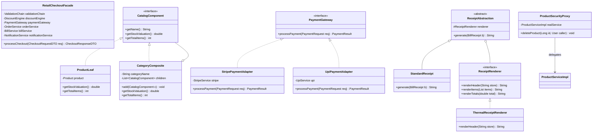
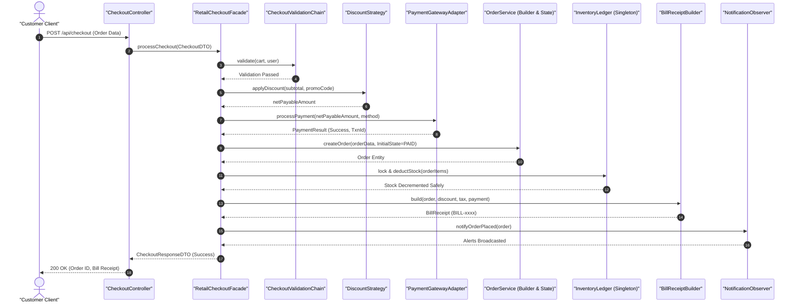
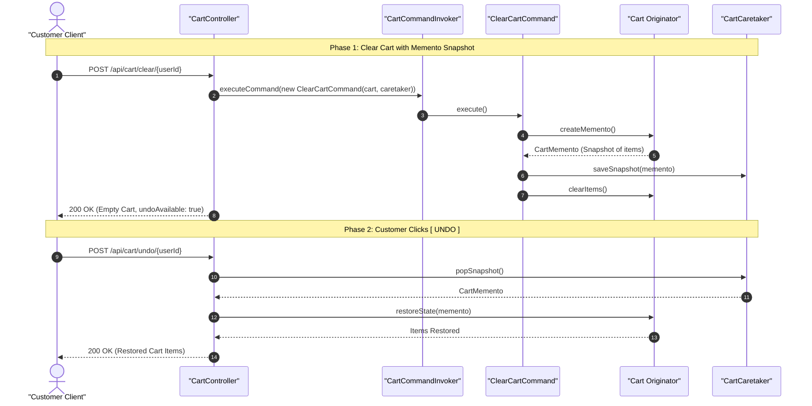
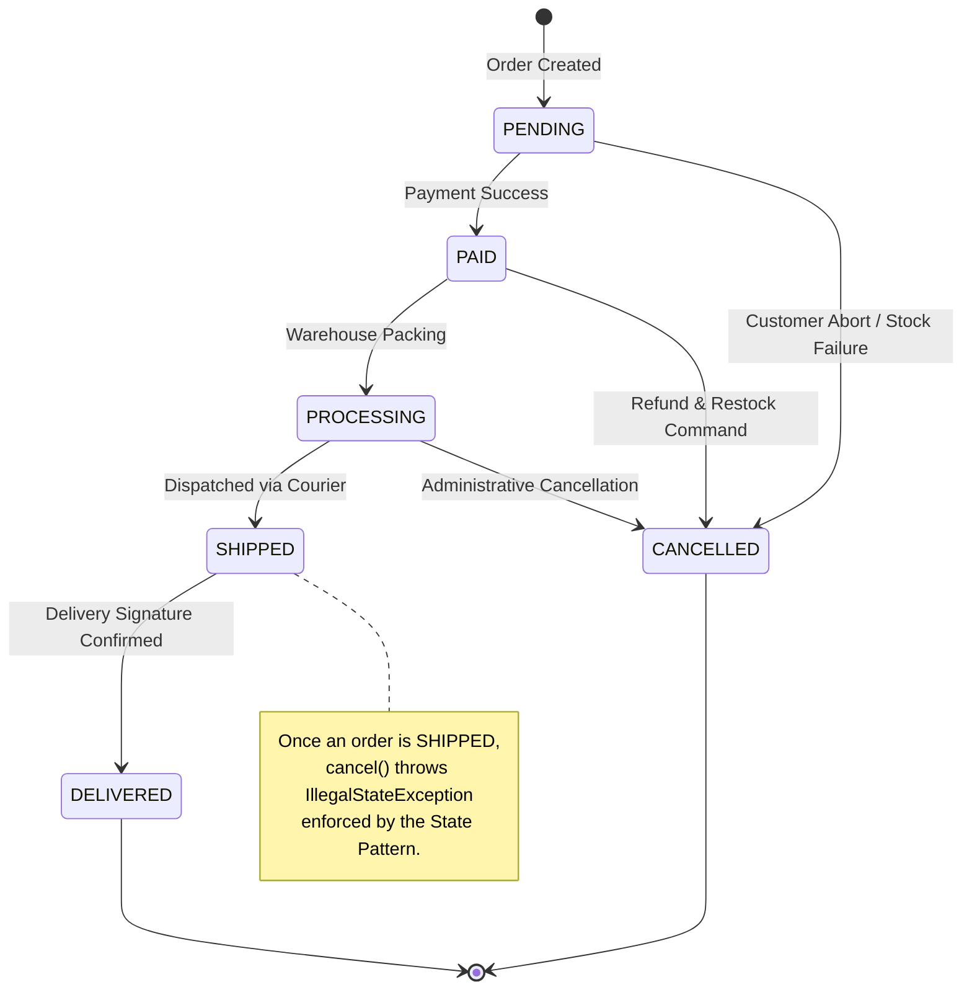
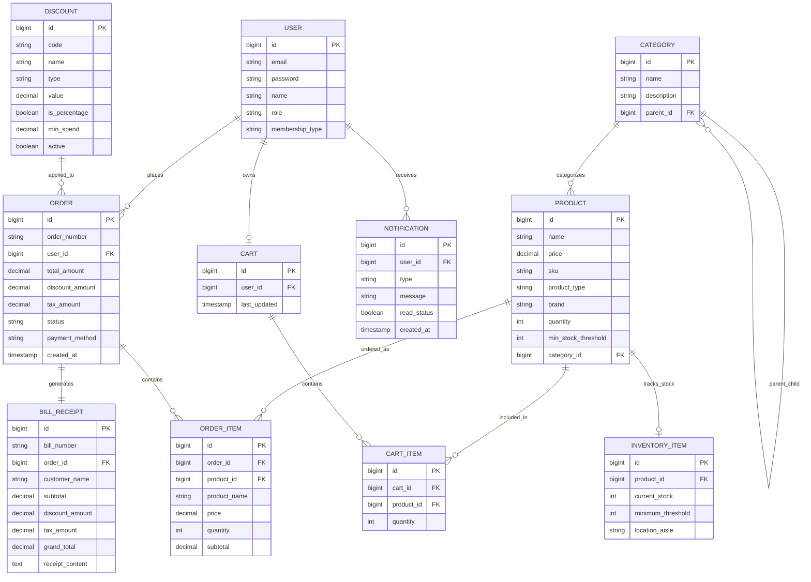

# UML & ARCHITECTURAL DIAGRAMS SUITE
### Smart Retail Management System
**Department of Computer Science and Engineering | B.E. Degree Capstone**

---

## 1. System Architecture Diagram

```mermaid
graph TD
    subgraph ClientTier ["Client Tier (React 18 SPA - Vite)"]
        UI_Cust["Customer Views (Catalog, Cart, Checkout, Invoices)"]
        UI_Admin["Admin Views (Dashboard, Products, Inventory, Discounts)"]
        UI_Modal["Design Pattern Explorer Modal (29 Patterns)"]
    end

    subgraph APITier ["API & Controller Tier (Spring Web MVC)"]
        AuthController["AuthController"]
        ProductController["ProductController"]
        CartController["CartController"]
        CheckoutController["CheckoutController"]
        OrderController["OrderController"]
        BillController["BillController"]
        InvController["InventoryController"]
        NotificationController["NotificationController"]
    end

    subgraph AppPatterns ["Application Architecture Patterns"]
        MVP["MVP: Discount Presenter"]
        MVI["MVI: Reactive Cart Intent Flow"]
        MVVM["MVVM: UI Hooks & ViewModels"]
        VIPER["VIPER: High-Reliability Inventory Module"]
    end

    subgraph DomainCore ["GoF Design Patterns Core"]
        Creational["Creational Patterns (Factory, Builder, Prototype, Singleton, Abstract Factory)"]
        Structural["Structural Patterns (Adapter, Bridge, Composite, Decorator, Facade, Flyweight, Proxy)"]
        Behavioral["Behavioral Patterns (Chain of Resp, Command, Iterator, Mediator, Memento, Observer, State, Strategy, Template, Visitor)"]
    end

    subgraph PersistenceTier ["Persistence Tier (Spring Data JPA)"]
        UserRepo["UserRepository"]
        ProductRepo["ProductRepository"]
        OrderRepo["OrderRepository"]
        BillRepo["BillReceiptRepository"]
        InvRepo["InventoryRepository"]
    end

    subgraph DataStorage ["Data Storage Layer"]
        MySQL[("MySQL 8.0 / H2 Database")]
    end

    ClientTier -->|JSON over HTTP| APITier
    APITier --> AppPatterns
    APITier --> DomainCore
    AppPatterns --> DomainCore
    DomainCore --> PersistenceTier
    PersistenceTier --> DataStorage
```



---

## 2. Use Case Diagram

```mermaid
graph LR
    actor Customer as "Customer"
    actor Admin as "Administrator"
    actor Gateway as "External Payment Gateway"

    subgraph Storefront ["Smart Retail Storefront"]
        UC1(["Browse & Search Products"])
        UC2(["Filter by Stock (Iterator)"])
        UC3(["Add / Modify Cart (Command)"])
        UC4(["Undo Clear Cart (Memento)"])
        UC5(["Apply Voucher (Strategy)"])
        UC6(["Checkout Order (Facade)"])
        UC7(["Print Thermal Bill (Bridge)"])
        UC8(["Track Order Status (State)"])
    end

    subgraph Administration ["Store Administration"]
        UC9(["Create Product Subtypes (Factory)"])
        UC10(["Clone Product SKU (Prototype)"])
        UC11(["Inspect Composite Valuation (Composite)"])
        UC12(["Thread-Safe Stock Adjust (Singleton)"])
        UC13(["Receive Low-Stock Alerts (Observer)"])
        UC14(["Advance Order State (State)"])
        UC15(["Run GST Tax Audit (Visitor)"])
        UC16(["Delete Product (Security Proxy)"])
    end

    Customer --> UC1
    Customer --> UC2
    Customer --> UC3
    Customer --> UC4
    Customer --> UC5
    Customer --> UC6
    Customer --> UC7
    Customer --> UC8

    Admin --> UC9
    Admin --> UC10
    Admin --> UC11
    Admin --> UC12
    Admin --> UC13
    Admin --> UC14
    Admin --> UC15
    Admin --> UC16

    UC6 --> Gateway
```

---

## 3. Creational Patterns Class Diagram

```mermaid
classDiagram
    class ProductFactory {
        <<abstract>>
        +createProduct(ProductDTO dto)* Product
    }
    class FoodProductFactory {
        +createProduct(ProductDTO dto) Product
    }
    class ElectronicsProductFactory {
        +createProduct(ProductDTO dto) Product
    }
    class GroceryProductFactory {
        +createProduct(ProductDTO dto) Product
    }
    ProductFactory <|-- FoodProductFactory
    ProductFactory <|-- ElectronicsProductFactory
    ProductFactory <|-- GroceryProductFactory

    class ProductPrototype {
        <<interface>>
        +cloneProduct(String name, Double price, String sku) Product
    }
    class Product {
        -Long id
        -String name
        -Double price
        -String sku
        +cloneProduct(String name, Double price, String sku) Product
    }
    ProductPrototype <|.. Product

    class BillReceiptBuilder {
        -BillReceipt bill
        +withBillNumber(String num) BillReceiptBuilder
        +forOrder(Order order) BillReceiptBuilder
        +withCustomer(String name, String email) BillReceiptBuilder
        +withSubtotal(Double subtotal) BillReceiptBuilder
        +applyDiscount(Double discount) BillReceiptBuilder
        +calculateTax(Double rate) BillReceiptBuilder
        +build() BillReceipt
    }
    class BillReceipt {
        -String billNumber
        -Double subtotal
        -Double taxAmount
        -Double grandTotal
    }
    BillReceiptBuilder ..> BillReceipt : constructs

    class InventoryLedgerManager {
        -static InventoryLedgerManager instance
        -ConcurrentHashMap productLocks
        -InventoryLedgerManager()
        +static getInstance() InventoryLedgerManager
        +lockProduct(Long productId) void
        +unlockProduct(Long productId) void
    }

    class RetailReceiptFactory {
        <<interface>>
        +createFormatter() ReceiptFormatter
        +createProcessor() PaymentProcessor
    }
    class PhysicalStoreReceiptFactory {
        +createFormatter() ReceiptFormatter
        +createProcessor() PaymentProcessor
    }
    class OnlineReceiptFactory {
        +createFormatter() ReceiptFormatter
        +createProcessor() PaymentProcessor
    }
    RetailReceiptFactory <|.. PhysicalStoreReceiptFactory
    RetailReceiptFactory <|.. OnlineReceiptFactory
```



---

## 4. Structural Patterns Class Diagram



---

## 5. Behavioral Patterns Class Diagram

```mermaid
classDiagram
    class CartCommand {
        <<interface>>
        +execute() void
        +undo() void
    }
    class AddToCartCommand {
        -Cart cart
        -Product product
        -int quantity
        +execute() void
        +undo() void
    }
    class ClearCartCommand {
        -Cart cart
        -CartCaretaker caretaker
        +execute() void
        +undo() void
    }
    CartCommand <|.. AddToCartCommand
    CartCommand <|.. ClearCartCommand

    class CartMemento {
        -List~CartItemSnapshot~ state
        ~getSavedState() List~CartItemSnapshot~
    }
    class CartCaretaker {
        -Deque~CartMemento~ history
        +saveSnapshot(CartMemento m) void
        +popSnapshot() CartMemento
    }
    CartCaretaker o-- CartMemento

    class OrderState {
        <<interface>>
        +next(Order context) void
        +cancel(Order context) void
        +getStatusName() String
    }
    class PaidState {
        +next(Order context) void
        +cancel(Order context) void
    }
    class ProcessingState {
        +next(Order context) void
        +cancel(Order context) void
    }
    class ShippedState {
        +next(Order context) void
        +cancel(Order context) void
    }
    OrderState <|.. PaidState
    OrderState <|.. ProcessingState
    OrderState <|.. ShippedState

    class DiscountStrategy {
        <<interface>>
        +applyDiscount(double amount) double
    }
    class PercentageDiscountStrategy {
        -double percentage
        +applyDiscount(double amount) double
    }
    class FlatDiscountStrategy {
        -double discountAmount
        +applyDiscount(double amount) double
    }
    DiscountStrategy <|.. PercentageDiscountStrategy
    DiscountStrategy <|.. FlatDiscountStrategy

    class InventorySubject {
        -List~InventoryObserver~ observers
        +attach(InventoryObserver o) void
        +notifyLowStock(Product p) void
    }
    class InventoryObserver {
        <<interface>>
        +onLowStockAlert(Product p) void
    }
    class AdminAlertObserver {
        +onLowStockAlert(Product p) void
    }
    InventorySubject o-- InventoryObserver
    InventoryObserver <|.. AdminAlertObserver
```



---

## 6. Sequence Diagram: Multi-Step Checkout Flow



---

## 7. Sequence Diagram: Cart Clear & Memento Undo



---

## 8. State Machine Diagram: Order Lifecycle



---

## 9. Entity Relationship (ER) Diagram


